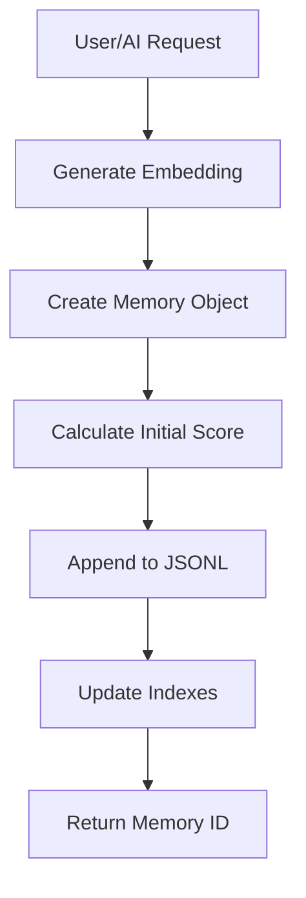
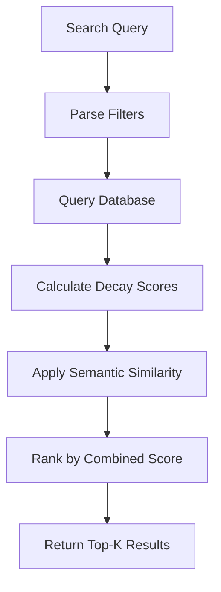
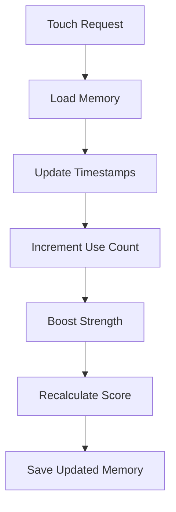
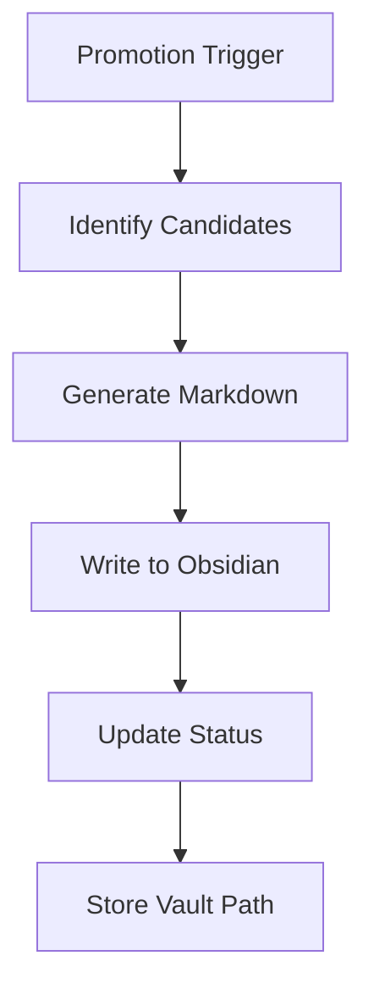

# Mnemex Architecture Deep Dive: Building Human-Like Memory Systems

*Published on [simpleminded.bot](https://simpleminded.bot) - Part 2 of "Building AI Memory Systems with Mnemex"*

---

## Introduction

In [Part 1](https://simpleminded.bot/introduction-to-mnemex), we explored Mnemex's novel approach to AI memory and its key innovations. Now let's dive deep into the technical architecture that makes these human-like memory dynamics possible.

Mnemex isn't just another database—it's a sophisticated system that implements biologically-inspired memory patterns through careful mathematical modeling and efficient data structures.

## System Architecture Overview

Mnemex follows a layered architecture that separates concerns while maintaining high performance:

```
┌─────────────────────────────────────┐
│       MCP Tools (API Layer)         │
│  save, search, touch, gc, promote   │
└─────────────────┬───────────────────┘
                  │
┌─────────────────▼───────────────────┐
│         Core Logic Layer            │
│   decay, scoring, clustering        │
└─────────────────┬───────────────────┘
                  │
┌─────────────────▼───────────────────┐
│      Storage Layer (JSONL)          │
│  human-readable files + models      │
└─────────────────────────────────────┘
```

## The Mathematical Foundation

### Temporal Decay Models

Mnemex supports three decay models, each with different characteristics:

#### 1. Power-Law Decay (Default)
```
f(Δt) = (1 + Δt/t₀)^(-α)
```

**Characteristics:**
- Heavier tail - retains older-but-important memories better
- Most human-like retention pattern
- Parameters: α (shape), t₀ (characteristic time)

#### 2. Exponential Decay
```
f(Δt) = e^(-λ × Δt)
```

**Characteristics:**
- Lighter tail - forgets sooner
- Simpler mathematics
- Parameter: λ (decay constant)

#### 3. Two-Component Exponential
```
f(Δt) = w × e^(-λf × Δt) + (1-w) × e^(-λs × Δt)
```

**Characteristics:**
- Fast early forgetting + heavier tail
- Mimics short-term and long-term memory phases
- Parameters: λf (fast), λs (slow), w (weight)

### The Complete Scoring Formula

All models use the same combined scoring function:

```
score = (use_count^β) × f(Δt) × strength
```

Where:
- **use_count**: Number of times memory has been accessed
- **β (beta)**: Sub-linear exponent (default: 0.6)
- **f(Δt)**: Decay function based on selected model
- **strength**: Importance multiplier (0.0-2.0)

## Core Components

### 1. Memory Storage Engine

Mnemex uses JSONL (JSON Lines) format for storage, providing several advantages:

**Human-Readable Format:**
```json
{"id":"mem-abc123","content":"I prefer TypeScript over JavaScript","tags":["preferences","typescript"],"created_at":1736275200,"last_used":1736275200,"use_count":1,"strength":1.0,"status":"active"}
```

**Benefits:**
- Easy to inspect and debug
- Git-friendly for version control
- No special tools needed to read/edit
- Efficient streaming for large datasets

**File Structure:**
```
~/.config/mnemex/jsonl/
├── memories.jsonl      # Main memory storage
├── relations.jsonl     # Knowledge graph edges
└── index.jsonl         # Search indexes
```

### 2. Temporal Decay Engine

The decay engine is the heart of Mnemex's memory dynamics:

```python
def calculate_score(memory, now):
    """Calculate current decay score for a memory."""
    time_delta = now - memory.last_used
    
    # Use count component (sub-linear)
    use_factor = math.pow(memory.use_count, beta)
    
    # Decay component (model-specific)
    if model == "exponential":
        decay_factor = math.exp(-lambda_ * time_delta)
    elif model == "power_law":
        decay_factor = math.pow(1 + time_delta / t0, -alpha)
    elif model == "two_component":
        decay_factor = (w * math.exp(-lambda_fast * time_delta) + 
                       (1-w) * math.exp(-lambda_slow * time_delta))
    
    # Strength multiplier
    return use_factor * decay_factor * memory.strength
```

### 3. Knowledge Graph System

Mnemex implements a sophisticated knowledge graph that tracks relationships between memories:

**Graph Structure:**
```json
{
  "memories": [
    {
      "id": "mem-123",
      "content": "Project X deadline is Friday",
      "entities": ["project-x"],
      "tags": ["deadline", "work"],
      "score": 0.82
    }
  ],
  "relations": [
    {
      "from": "mem-123",
      "to": "mem-456", 
      "type": "references",
      "strength": 0.9
    }
  ]
}
```

**Key Features:**
- **Entity tracking**: Named entities (people, projects, concepts)
- **Explicit relations**: Directed links between memories
- **Temporal scoring**: Graph operations respect memory decay
- **Bidirectional navigation**: Follow relationships in both directions

### 4. Memory State Management

Memories flow through different states based on their scores and usage:

```
ACTIVE → [high score/usage] → PROMOTED
   ↓
[low score]
   ↓
ARCHIVED or DELETED
```

**State Transitions:**
- **ACTIVE**: Normal short-term memory undergoing decay
- **PROMOTED**: Moved to long-term storage (Obsidian)
- **ARCHIVED**: Low-scoring but preserved (optional)
- **DELETED**: Removed during garbage collection

## Data Flow Architecture

### Saving a Memory



### Searching Memories



### Memory Reinforcement



### Promotion Flow



## Performance Characteristics

### Memory Operations

**Typical Performance (single user, local storage):**
- Save memory: < 10ms
- Search (10 results): < 50ms
- Touch memory: < 5ms
- Garbage collection (1000 memories): < 100ms

### Storage Efficiency

**JSONL Benefits:**
- No database overhead
- Compressible with standard tools
- Streamable for large datasets
- Human-readable for debugging

**Memory Usage:**
- ~1KB per memory (including metadata)
- Indexes: ~10% of data size
- Embeddings (optional): ~1.5KB per memory

### Scaling Considerations

**Current Design Targets:**
- 1,000-10,000 active memories
- Single user, single machine
- Local-first architecture

**For Larger Scales:**
- External databases (PostgreSQL, etc.)
- Vector databases (Qdrant, Weaviate)
- Distributed MCP architecture

## Advanced Features

### 1. Clustering and Consolidation

Mnemex can automatically detect and merge similar memories:

**Similarity Detection:**
```python
def cluster_memories(threshold=0.83):
    """Find clusters of similar memories."""
    # Generate embeddings for all memories
    embeddings = generate_embeddings(memories)
    
    # Calculate pairwise similarities
    similarities = cosine_similarity(embeddings)
    
    # Find clusters using single-linkage
    clusters = single_linkage_clustering(similarities, threshold)
    
    return clusters
```

**Consolidation Strategies:**
- **Auto-merge** (cohesion ≥ 0.9): Clear duplicates
- **LLM-review** (0.75 ≤ cohesion < 0.9): Require human review
- **Keep-separate** (cohesion < 0.75): Different enough to preserve

### 2. Smart Prompting Integration

Mnemex includes sophisticated prompting patterns for natural AI integration:

**Auto-Save Pattern:**
```python
def auto_save_pattern(user_input):
    """Detect when to save memories automatically."""
    if contains_preference(user_input):
        save_memory(content=user_input, 
                   tags=extract_tags(user_input),
                   strength=1.5)
```

**Auto-Recall Pattern:**
```python
def auto_recall_pattern(user_query):
    """Find relevant memories for context."""
    relevant = search_memory(query=user_query, 
                           min_score=0.3,
                           top_k=5)
    return format_context(relevant)
```

### 3. Long-Term Memory Integration

**Obsidian Integration:**
```markdown
---
created: 2025-01-07
tags: [preferences, typescript, programming]
entities: [TypeScript, JavaScript]
source: stm_promotion
---

# TypeScript Preference

I prefer TypeScript over JavaScript for all new projects.

**Related memories:**
- [[Modern JavaScript Frameworks]]
- [[Type Safety Best Practices]]
```

## Configuration and Tuning

### Decay Model Selection

**Power-Law (Default):**
```bash
MNEMEX_DECAY_MODEL=power_law
MNEMEX_PL_ALPHA=1.1
MNEMEX_PL_HALFLIFE_DAYS=3.0
```

**Exponential:**
```bash
MNEMEX_DECAY_MODEL=exponential
MNEMEX_DECAY_LAMBDA=2.673e-6  # 3-day half-life
```

**Two-Component:**
```bash
MNEMEX_DECAY_MODEL=two_component
MNEMEX_TC_LAMBDA_FAST=1.603e-5  # ~12h
MNEMEX_TC_LAMBDA_SLOW=1.147e-6  # ~7d
MNEMEX_TC_WEIGHT_FAST=0.7
```

### Threshold Tuning

**Balanced (Default):**
```bash
MNEMEX_FORGET_THRESHOLD=0.05
MNEMEX_PROMOTE_THRESHOLD=0.65
MNEMEX_PROMOTE_USE_COUNT=5
MNEMEX_PROMOTE_TIME_WINDOW=14
```

**Aggressive Forgetting:**
```bash
MNEMEX_FORGET_THRESHOLD=0.10
MNEMEX_PROMOTE_THRESHOLD=0.70
```

**Conservative Retention:**
```bash
MNEMEX_FORGET_THRESHOLD=0.02
MNEMEX_PROMOTE_THRESHOLD=0.50
```

## Security and Privacy

### Data Protection

**Local-First Design:**
- All data stored on user's machine
- No cloud services or external dependencies
- No data sharing or telemetry

**Access Control:**
- File system permissions
- Optional encryption at rest
- Git integration for version control

### Memory Isolation

**User Data Separation:**
- Each user has isolated storage directory
- No cross-user memory access
- Configurable storage paths

## Future Architecture Enhancements

### 1. Adaptive Decay Parameters

```python
def adaptive_decay(memory_category):
    """Adjust decay based on memory type."""
    if memory_category == "credentials":
        return lambda_base * 0.5  # Slower decay
    elif memory_category == "ephemeral":
        return lambda_base * 2.0  # Faster decay
    else:
        return lambda_base
```

### 2. Spaced Repetition Integration

```python
def spaced_repetition_schedule(memory):
    """Calculate next review time."""
    if memory.use_count >= 5:
        interval = base_interval * (2 ** memory.review_count)
        return now + interval
```

### 3. Context-Aware Strength

```python
def context_aware_strength(content, context):
    """Boost strength based on conversation context."""
    if is_security_critical(content):
        return 2.0
    elif is_decision(content):
        return 1.5
    elif is_preference(content):
        return 1.3
    else:
        return 1.0
```

## Conclusion

Mnemex's architecture represents a sophisticated approach to AI memory that goes far beyond simple storage. By implementing biologically-inspired decay patterns, efficient data structures, and intelligent promotion systems, it creates memory dynamics that feel natural and human-like.

The key architectural insights are:

1. **Mathematical Foundation**: Temporal decay based on cognitive science research
2. **Layered Design**: Clear separation between API, logic, and storage layers
3. **Human-Readable Storage**: JSONL format for transparency and version control
4. **Knowledge Graph Integration**: Rich relationship tracking between memories
5. **Performance Optimization**: Efficient algorithms for real-time memory management

In Part 3, we'll explore practical implementation examples, showing how to integrate Mnemex into real-world applications and demonstrating the power of human-like AI memory in action.

---

*This is Part 2 of "Building AI Memory Systems with Mnemex." Stay tuned for Part 3: "Implementing Mnemex in Real-World Applications" where we'll explore practical implementation patterns and code examples.*

**Resources:**
- [Mnemex Architecture Documentation](https://github.com/simplemindedbot/mnemex/blob/main/docs/architecture.md)
- [Scoring Algorithm Details](https://github.com/simplemindedbot/mnemex/blob/main/docs/scoring_algorithm.md)
- [API Reference](https://github.com/simplemindedbot/mnemex/blob/main/docs/api.md)